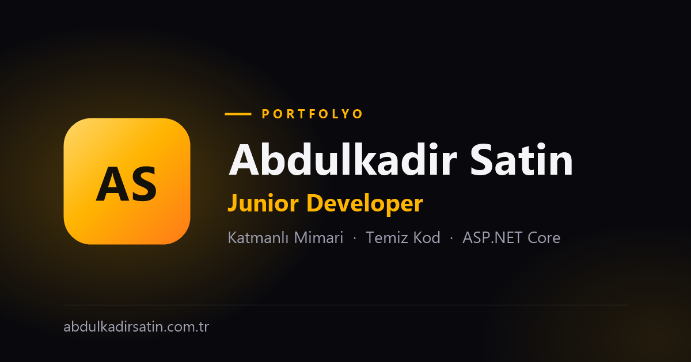

# MyPortfolio — Personal Portfolio & CMS




**Live:** [abdulkadirsatin.com.tr](https://abdulkadirsatin.com.tr)

A personal portfolio website with a built-in admin panel (CMS), built with **ASP.NET Core 8 MVC** on an **N-tier architecture**. Every section of the public site — profile, experience, skills, projects, certificates, testimonials, contact details — is managed from the admin panel, so content can be updated without touching code.

> 🇹🇷 Türkçe özet için [aşağıya](#-türkçe-özet) bakın.

---

## Features

### Public site
- **Single-page home** — hero, about, experience timeline, skills, featured certificates, projects, testimonials and a contact form, with scroll animations and a responsive dark "glassmorphism" design.
- **Project detail pages** — long description, technology list, image gallery with lightbox, and video (YouTube via the privacy-enhanced player, or an uploaded MP4/WebM).
- **Certificates page** — two-level categories (e.g. *Software › Front End*); a certificate can appear in several categories at once; filter chips; image or PDF certificates with verification links. Only certificates marked as *featured* appear on the home page.
- **Contact form** — sent via AJAX, protected by Cloudflare Turnstile, saved to the database and delivered by email (MailKit).

### Admin panel (CMS)
- Create / edit / delete for every section of the site.
- Image uploads are resized (max 1920 px) and converted to WebP automatically; PDF uploads are validated.
- **Account security** page to change the login username and password.

### Security
- **Hidden admin login** — the login page only opens with a secret key in the URL and returns 404 otherwise. If the key is not configured, login stays closed (fail-closed).
- **ASP.NET Core Identity** — strong password policy (8+ chars, upper/lower case, digit, symbol), account lockout for 30 minutes after 5 failed attempts, and other sessions are invalidated when the password changes.
- **Content-Security-Policy** with a per-request nonce (no `unsafe-inline` scripts), plus `X-Frame-Options`, `X-Content-Type-Options`, `Referrer-Policy` and `Permissions-Policy` headers.
- **CSRF protection** on every POST request (global antiforgery validation).
- **Rate limiting** — contact form: 5 requests/minute, login: 10 requests/5 minutes per client IP.
- **Hardened uploads** — extension whitelist, content validation (images must parse, PDFs must have a PDF signature), random file names, path-traversal-safe deletion.
- **Secure cookies** — `HttpOnly`, `SameSite=Strict`, `Secure`.

### Performance & SEO
- Home page sections are cached and the cache is invalidated the moment the admin saves a change.
- WebP images and bundled CSS (WebOptimizer).
- Meta descriptions, canonical URLs, Open Graph / Twitter cards and **JSON-LD** structured data (Person, WebSite, CreativeWork) generated from CMS content.
- Dynamic `sitemap.xml` and `robots.txt`, `www` → non-`www` redirect, `noindex` on admin, login and error pages.

---

## Tech stack

| Area | Technologies |
|---|---|
| Backend | ASP.NET Core 8 MVC, C# |
| Data | Entity Framework Core 8, SQL Server |
| Auth | ASP.NET Core Identity |
| Mapping & validation | AutoMapper, FluentValidation |
| Media & mail | SixLabors.ImageSharp, MailKit |
| Frontend | Bootstrap 5, Swiper, SweetAlert2, Font Awesome, vanilla JavaScript |
| Bot protection | Cloudflare Turnstile |

## Architecture

```
MyPortfolio.sln
├── MyPortfolio.EntityLayer       Entities (BaseEntity, Portfolio, Certificate, AppUser, …)
├── MyPortfolio.DataAccessLayer   DbContext, generic repository, EF Core migrations
├── MyPortfolio.BusinessLayer     Services, DTOs, validation rules, AutoMapper profile, helpers
└── MyPortfolio (WebUI)           Controllers, views, view components, middleware, security
```

Request flow: **Controller → Service (BusinessLayer) → Generic repository (DataAccessLayer) → SQL Server**

---

## Getting started

### Prerequisites
- [.NET 8 SDK](https://dotnet.microsoft.com/download/dotnet/8.0)
- SQL Server (Express or LocalDB is enough for development)
- EF Core CLI: `dotnet tool install --global dotnet-ef`

### 1. Configure
Copy `appsetting.Examle.json` to `MyPortfolio/appsettings.Development.json` and fill in the values:

| Setting | Purpose |
|---|---|
| `ConnectionStrings:DefaultConnection` | SQL Server connection string |
| `AdminUser:UserName` / `Email` / `Password` | First admin account, created automatically on the first run. On an empty database the app refuses to start without them. |
| `AdminSettings:LoginKey` | Secret key for the admin login URL |
| `MailSettings:*` | SMTP settings for contact form emails |
| `TurnstileSettings:SiteKey` / `SecretKey` | Cloudflare Turnstile. For local development use Cloudflare's [test keys](https://developers.cloudflare.com/turnstile/troubleshooting/testing/). |
| `AutoMapper:LicenseKey` | Required in production (a free Community license is available at luckypennysoftware.com) |
| `Seo:BaseUrl` | *(optional)* Public URL used for canonical links and the sitemap |

Any setting can also be supplied as an environment variable, e.g. `AdminUser__Password`.

### 2. Create the database
```bash
dotnet ef database update --project MyPortfolio.DataAccessLayer --startup-project MyPortfolio
```

### 3. Run
```bash
dotnet run --project MyPortfolio
```

The admin panel is at `/Login/Index?key=<your LoginKey>`.

### Deployment notes
Step-by-step guide (in Turkish): [DEPLOY.md](DEPLOY.md)

- Apply migrations to the production database **before** deploying new code, e.g. generate a script with `dotnet ef migrations script --idempotent`.
- Set `ASPNETCORE_ENVIRONMENT=Production`.
- Uploaded files live in `wwwroot/images`, `wwwroot/videos` and `wwwroot/certificates`; make sure publishing does not delete files that exist only on the server.
- The IIS request limit is raised to 100 MB in `web.config` for video uploads.

---

## 🇹🇷 Türkçe özet

**ASP.NET Core 8 MVC** ile **katmanlı mimaride** geliştirilmiş, yönetim paneli (CMS) olan kişisel portfolyo sitesi. Sitedeki her bölüm (profil, deneyimler, yetenekler, projeler, sertifikalar, referanslar, iletişim) admin panelinden yönetilir; içerik güncellemek için koda dokunmak gerekmez.

**Öne çıkanlar**
- **Proje detay sayfaları:** galeri, lightbox ve video (YouTube ya da yüklenen MP4).
- **Sertifikalar:** iki seviyeli kategoriler (Yazılım › Front End); bir sertifika birden fazla kategoride görünebilir, görsel ya da PDF olarak yüklenebilir.
- **Güvenlik:** gizli anahtarlı admin girişi, Identity şifre politikası ve hesap kilidi, nonce tabanlı CSP, CSRF koruması, IP bazlı istek sınırı, içerik doğrulamalı dosya yükleme.
- **SEO:** meta etiketleri, Open Graph, JSON-LD, dinamik sitemap ve robots.txt.

**Kurulum:** `appsetting.Examle.json` dosyasını `MyPortfolio/appsettings.Development.json` olarak kopyalayıp doldurun; ardından `dotnet ef database update` ve `dotnet run` komutlarını çalıştırın (komutların tamamı yukarıda).

---

## Contact

**Abdulkadir Satin** — [abdulkadirsatin.com.tr](https://abdulkadirsatin.com.tr) · [LinkedIn](https://www.linkedin.com/in/abdulkadir-satin/) · [GitHub](https://github.com/SatinAbdulkadir)

## License

Released under the [MIT License](LICENSE).
